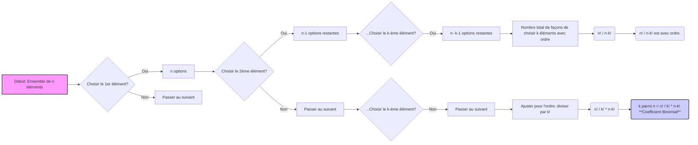

# Introduction
*   Le **Coefficient Binomial** est un concept essentiel en combinatoire et en probabilités.
*   Il apparaît notamment dans la loi binomiale.

# Définition
*   Le coefficient binomial ${n \choose k}$ (prononcé "k parmi n") représente le **nombre de façons de choisir un sous-ensemble de k éléments à partir d'un ensemble de n éléments distincts**, sans tenir compte de l'ordre des éléments choisis.

# Formule
*   Le coefficient binomial est calculé comme suit :

$$ {n \choose k} = \frac{n!}{k!(n-k)!} $$

Où :
    *   `n!` est le factorial de n (n * (n-1) * (n-2) * ... * 1)
    *   `k!` est le factorial de k (k * (k-1) * (k-2) * ... * 1)
    *   `(n-k)!` est le factorial de (n-k)

# Exemple de Calcul

Calculer ${5 \choose 2}$ :

$$ {5 \choose 2} = \frac{5!}{2!(5-2)!} = \frac{5!}{2!3!} $$
$$ = \frac{5 \times 4 \times 3 \times 2 \times 1}{(2 \times 1)(3 \times 2 \times 1)} $$
$$ = \frac{5 \times 4}{2 \times 1} = 10 $$
Il y a donc 10 façons de choisir 2 éléments parmi 5.

# Propriétés et Interprétations

1.  **Symétrie :** ${n \choose k} = {n \choose n-k}$
    *   Choisir k éléments, c'est la même chose que d'exclure n-k éléments.

2.  **Cas particuliers :**
    *   ${n \choose 0} = 1$ (Il n'y a qu'une façon de ne rien choisir.)
    *   ${n \choose n} = 1$ (Il n'y a qu'une façon de choisir tous les éléments.)
    *   ${n \choose 1} = n$ (Il y a n façons de choisir un seul élément.)

3.  **Triangle de Pascal :**
    *   Les coefficients binomiaux peuvent être organisés dans un triangle, où chaque nombre est la somme des deux nombres au-dessus de lui.
    *   Cela fournit une méthode visuelle pour calculer les coefficients.

# Utilisation

*   **Probabilités :** Calcul de probabilités dans des situations combinatoires.
*   **Statistiques :**  Occurrence dans des distributions comme la loi binomiale.
*   **Informatique :** Algorithmes combinatoires.

# Points Importants

*   Bien comprendre la notion de factorial.
*   Maîtriser la formule de calcul.
*   Connaître les propriétés pour simplifier certains calculs.

