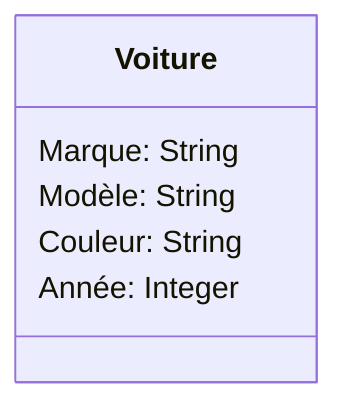
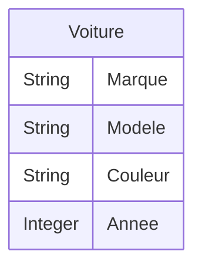
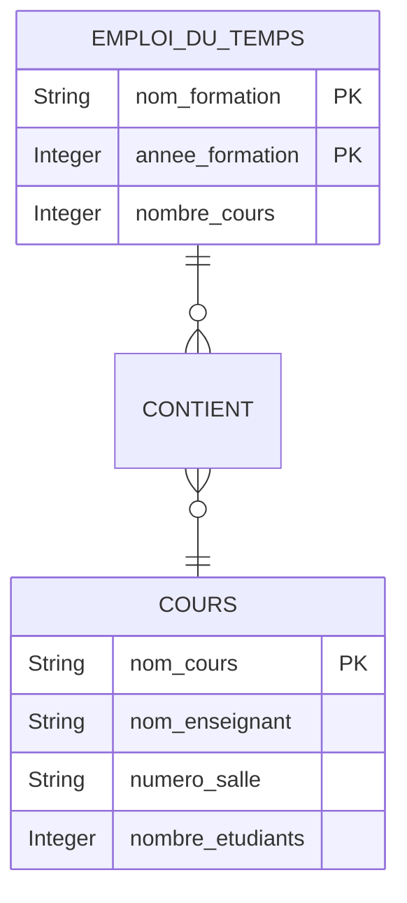
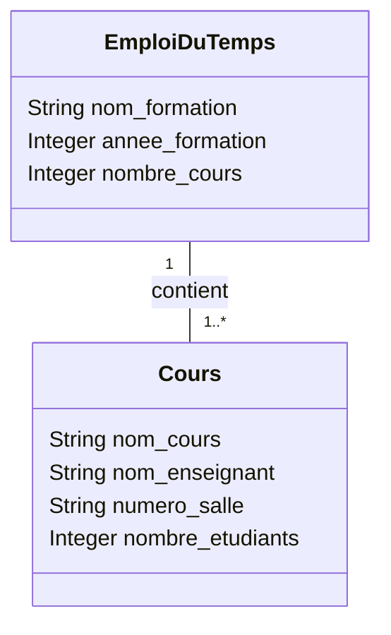
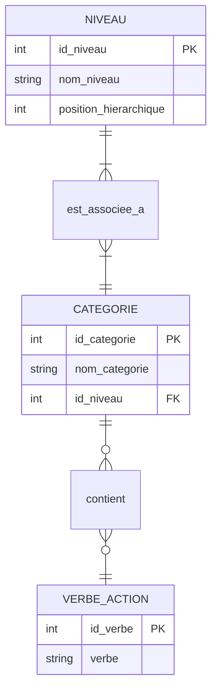
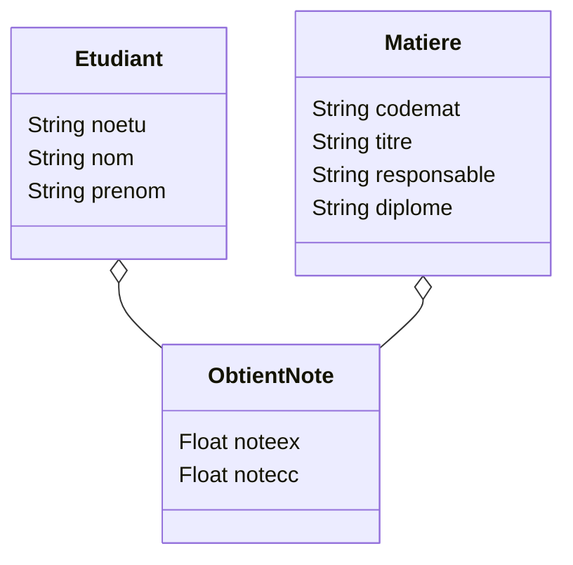

# Remobilisation des connaissances

1) Lexique

*   Table ou relation : Représentation d’une donnée du monde réel composée d’une liste de propriétés.
*   Champ, attribut ou colonne : Propriété caractérisée par un nom et un type élémentaire.
*   Tuple, ligne ou n-uplet : Contient une information pour chaque propriété d’une relation.

2) Formalismes

a) Pour chacun des concepts du 1) donner leurs représentation dans les formalismes de l’UML (Unified Modeling Language) et E/R (Entity/Relation Model).

*   Table/Relation :
    *   UML : Classe (un rectangle avec le nom de la classe).
    *   E/R : Entité (un rectangle avec le nom de l'entité).

*   Champ/Attribut :
    *   UML : Attribut (listé sous le nom de la classe, avec nom et type).
    *   E/R : Attribut (une ellipse rattachée à l'entité).

*   Tuple/Ligne :
    *   UML : Instance d'objet (non directement représenté par un symbole unique, mais par des objets spécifiques de la classe).
    *   E/R : Instance d'entité (non directement représenté par un symbole, mais par des enregistrements spécifiques de l'entité).

b) Pour les affirmations suivantes, donner la représentation utilisée pour représenter la cardinalité de la relation décrite :

*   Une personne habite à une adresse et à une adresse habite 1 personne.
    *   UML : Personne "1" -- "1" Adresse
    *   E/R : Côté Personne vers Adresse : (1,1) ; Côté Adresse vers Personne : (1,1)

*   Une personne possède entre 0 et N voitures et une voiture est possédée par 1 personne.
    *   UML : Personne "0..\*" -- "1" Voiture
    *   E/R : Côté Personne vers Voiture : (0,n) ou (0,*) ; Côté Voiture vers Personne : (1,1)

*   Un vendeur peut vendre entre 0 et M produits et un produit peut être vendu par N vendeurs.
    *   UML : Vendeur "0..\*" -- "0..*" Produit OU Vendeur "0..*" -- "0..*" Produit
    *   E/R : Côté Vendeur vers Produit : (0,m) ou (0,*) ; Côté Produit vers Vendeur : (0,n) ou (0,*)

2) Entités

*   Quelle est la différence entre une classe d’entité et une instance d’entité ?
    *   Une classe d'entité est une description générique (le modèle ou le type) d'un ensemble d'objets partageant les mêmes caractéristiques.
    *   Une instance d'entité est un objet spécifique et concret (un exemplaire) de cette classe, avec des valeurs réelles pour ses attributs.

*   Donner un exemple sous la forme d’une table, d’une représentation UML, et d’une représentation E/R.

    *   Classe d'entité : Voiture
    *   Instance d'entité : Une voiture spécifique : "Renault", "Clio", "Bleue", 2020

    *   Représentation sous forme de table :

| Marque  | Modèle | Couleur | Année |
| :------ | :----- | :------ | :---- |
| Renault | Clio   | Bleue   | 2020  |
| Peugeot | 208    | Rouge   | 2021  |

    *   Représentation UML :

    *   Représentation E/R :

### Exercice 1 - Emploi du temps

1) Nous allons réaliser le modèle entité-association représentant cette situation. Donner les classes d’entités pouvant correspondre au deux entités cours et emploi du temps en suivant le formalisme E/R ou UML.

**Formalisme E/R :**

*   Entité COURS
    *   nom_cours (Identifiant / Clé primaire)
    *   nom_enseignant
    *   numero_salle
    *   nombre_etudiants

*   Entité EMPLOI_DU_TEMPS
    *   nom_formation (Identifiant / Clé primaire)
    *   annee_formation (Identifiant / Clé primaire)
    *   nombre_cours

2) Donner les relations associant ses deux entités.

Une relation nommée CONTIENT va associer EMPLOI_DU_TEMPS et COURS.

3) Pour chacune des relations donner leurs cardinalité.

*   Un EMPLOI_DU_TEMPS CONTIENT (1,n) COURS.
*   Un COURS est CONTENU_DANS (1,1) EMPLOI_DU_TEMPS.

**Diagramme E/R complet pour les questions 1 à 3 :**

Cardinalité : 1..N 1..N

4) Reprenez les questions 1 à 3 avec l’autre formalisme (E/R ou UML)

**Formalisme UML :**

1) Classes d’entités :

*   Classe Cours
    *   nom_cours: String (PK)
    *   nom_enseignant: String
    *   numero_salle: String
    *   nombre_etudiants: Integer

*   Classe EmploiDuTemps
    *   nom_formation: String (PK)
    *   annee_formation: Integer (PK)
    *   nombre_cours: Integer

2) Relations associant ses deux entités.

Une association contient entre EmploiDuTemps et Cours.

3) Pour chacune des relations donner leurs cardinalité.

*   EmploiDuTemps "1" -- contient -- "1..*" Cours

**Diagramme UML complet pour les questions 1 à 3 :**

---

### Exercice 2 - La taxonomie de Bloom

1) Nous allons réaliser le modèle entité-association représentant cette situation en suivant le formalisme de votre choix (E/R ou UML).

**Formalisme E/R :**

*   Entité NIVEAU
    *   id_niveau (PK)
    *   nom_niveau
    *   position_hierarchique

*   Entité CATEGORIE
    *   id_categorie (PK)
    *   nom_categorie
    *   id_niveau (FK)

*   Entité VERBE_ACTION
    *   id_verbe (PK)
    *   verbe

2) Donner les relations associant ses entités.

*   Une relation est_associee_a entre NIVEAU et CATEGORIE.
*   Une relation contient entre CATEGORIE et VERBE_ACTION.

3) Pour chacune des relations donner leurs cardinalité.

*   est_associee_a :
    *   Un NIVEAU est_associee_a (1,1) CATEGORIE.
    *   Une CATEGORIE est_associee_a (1,1) NIVEAU.

*   contient :
    *   Une CATEGORIE contient (1,n) VERBE_ACTION.
    *   Un VERBE_ACTION appartient_a (1,1) CATEGORIE.

**Diagramme E/R complet :**

---

### Exercice 3 - Gestion de notes

1) A partir de ces tables, réalisez le modèle entité-association représentant cette base de données (selon le formalisme de votre choix).

**Formalisme UML :**

*   Classe Etudiant
    *   noetu: String (PK)
    *   nom: String
    *   prenom: String

*   Classe Matiere
    *   codemat: String (PK)
    *   titre: String
    *   responsable: String
    *   diplome: String

*   Association obtient_note (entre Etudiant et Matiere)
    *   Un Etudiant obtient_note dans 0 ou plusieurs Matiere (0..*).
    *   Une Matiere est concernée par les notes de 0 ou plusieurs Etudiant (0..*).
    *   Attributs de l'association :
        *   noteex: Float
        *   notecc: Float

**Diagramme UML complet :**

MLD

